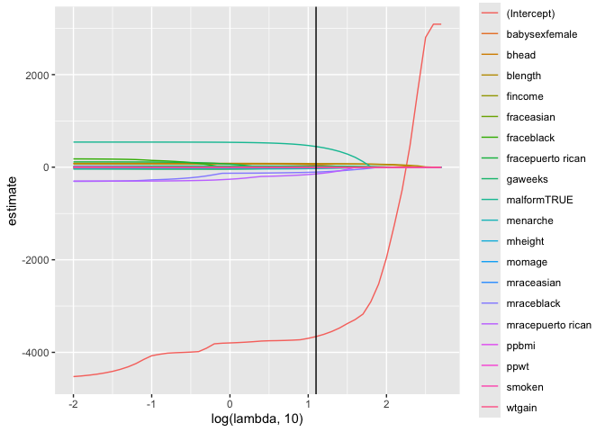
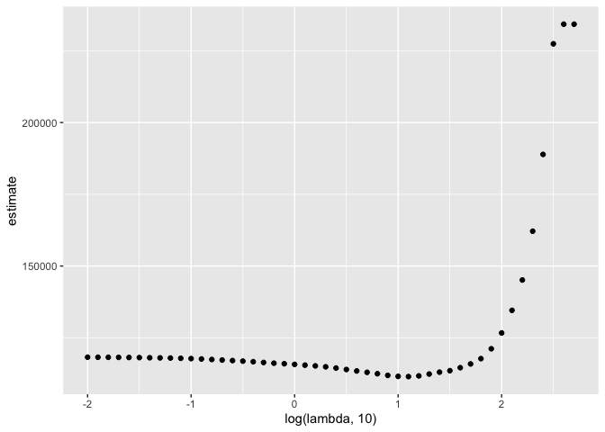

statistical learning
================
Mukta Patwari
2025-11-20

Load packages

``` r
library(tidyverse)
```

    ## ── Attaching core tidyverse packages ──────────────────────── tidyverse 2.0.0 ──
    ## ✔ dplyr     1.1.4     ✔ readr     2.1.5
    ## ✔ forcats   1.0.0     ✔ stringr   1.5.2
    ## ✔ ggplot2   4.0.0     ✔ tibble    3.3.0
    ## ✔ lubridate 1.9.4     ✔ tidyr     1.3.1
    ## ✔ purrr     1.1.0     
    ## ── Conflicts ────────────────────────────────────────── tidyverse_conflicts() ──
    ## ✖ dplyr::filter() masks stats::filter()
    ## ✖ dplyr::lag()    masks stats::lag()
    ## ℹ Use the conflicted package (<http://conflicted.r-lib.org/>) to force all conflicts to become errors

``` r
library(glmnet)
```

    ## Loading required package: Matrix
    ## 
    ## Attaching package: 'Matrix'
    ## 
    ## The following objects are masked from 'package:tidyr':
    ## 
    ##     expand, pack, unpack
    ## 
    ## Loaded glmnet 4.1-10

``` r
set.seed(11)
```

## Do LASSO

``` r
bwt_df = 
  read_csv("data/birthweight.csv") |> 
  janitor::clean_names() |>
  mutate(
    babysex = 
        case_match(babysex,
            1 ~ "male",
            2 ~ "female"
        ),
    babysex = fct_infreq(babysex),
    frace = 
        case_match(frace,
            1 ~ "white",
            2 ~ "black", 
            3 ~ "asian", 
            4 ~ "puerto rican", 
            8 ~ "other"),
    frace = fct_infreq(frace),
    mrace = 
        case_match(mrace,
            1 ~ "white",
            2 ~ "black", 
            3 ~ "asian", 
            4 ~ "puerto rican",
            8 ~ "other"),
    mrace = fct_infreq(mrace),
    malform = as.logical(malform)) |> 
  sample_n(200)
```

    ## Rows: 4342 Columns: 20
    ## ── Column specification ────────────────────────────────────────────────────────
    ## Delimiter: ","
    ## dbl (20): babysex, bhead, blength, bwt, delwt, fincome, frace, gaweeks, malf...
    ## 
    ## ℹ Use `spec()` to retrieve the full column specification for this data.
    ## ℹ Specify the column types or set `show_col_types = FALSE` to quiet this message.

Data processing

``` r
x = model.matrix(bwt ~ ., bwt_df)
y = bwt_df %>% pull(bwt)
```

Define some lambdas and fit Lasso for each

``` r
lambda = 10^(seq(-2, 2.75, 0.1))

lasso_fit =
  glmnet(x = x, y = y, lambda = lambda)

lasso_cv =
  cv.glmnet(x = x, y = y, lambda = lambda)

lambda_opt = lasso_cv[["lambda.min"]]
```

Evaluate what is happening in lasso_fit

``` r
lasso_fit %>% 
  broom::tidy() %>% 
  select(term, lambda, estimate) %>% 
  complete(term, lambda, fill = list(estimate = 0)) %>%
  filter(term != "Intercept") %>% 
  ggplot(aes(x = log(lambda, 10), y = estimate, group = term, color = term)) +
  geom_line() +
  geom_vline(xintercept = log(lambda_opt, 10))
```

<!-- -->

Plot 2

``` r
lasso_cv %>% 
  broom::tidy() %>% 
  ggplot(aes(x = log(lambda, 10), y = estimate)) +
  geom_point()
```

<!-- -->
